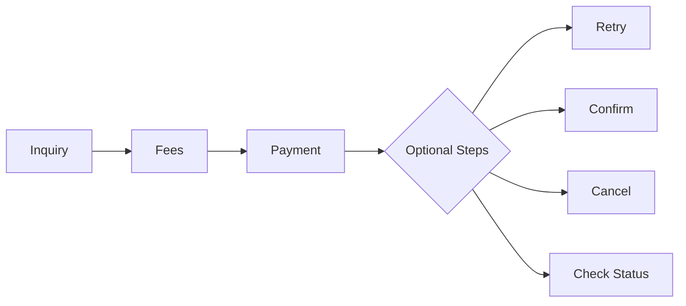

# 💰 Inquiry → Fees → Payment Flow

This flow is used for most transactional services in our ecosystem. It enables clients to:

- Retrieve billing data
- Calculate exact fees
- Execute and finalize the payment

---

## 🔁 Flow Diagram

## 🧩 Typical Use Cases

<div class="grid cards" markdown>

- :material-file-document-edit:{ .lg .middle } __Bill Payments__

    


- :material-ticket-confirmation:{ .lg .middle } __Vouchers__

    


- :material-cellphone:{ .lg .middle } __Top-Ups__

    


- :material-bank-transfer:{ .lg .middle } __Installments__

    


- :material-calendar-check:{ .lg .middle } __Booking__

    


- :material-hand-heart:{ .lg .middle } __Donations__

    


</div>

## 🔐 Pre-requisites{{unit_price}}

Before using this API, ensure the following:

- ✅ You are [authenticated](../Account%20Management/Authentication.md)
- ✅ The service is marked as **inquirable** in the [Service Catalog](../../../service-management/service-catalog.md)
- ✅ You have the correct:
  - `serviceId`
  - Required input parameters defined for the service


## 1. 🔍 Inquiry API

Retrieves required billing or service details.

### ✅ Endpoint

```http
POST /v2/services/{serviceId}/inquiry
```

### 📥 Inquiry Request
=== "REST"

    ```json title="REST Request"
    {
      "BillingAccount": "string",
      "localDate": "datetime",
      "version": "number",
      "serviceListVersion": "number",
      "Data": [
        {
          "Key": "string",
          "Value": "string",
          "Name": "string"
        }
      ]
    }
    ```

=== "GraphQL"

    ```graphql title="GraphQL Equivalent"
    query {
      serviceCatalog(version: 0) {
        id
        name
        services {
          serviceID
          serviceName
        }
      }
    }
    ```

=== "gRPC"

    ```protobuf title="gRPC Request"
    rpc GetServiceCatalog (ServiceCatalogRequest) returns (ServiceCatalogResponse);
    ```
---


### 📤 Inquiry Response

=== "REST"
```json title="REST Response"
{
  "Code": 200,
  "Message": "Success",
  "Brn": 123456,
  "Data": [...],
  "invoices": [...]
}
```

---
### 📥 Fees Request

=== "REST"

    ```json title="REST Request"
    {
      "amount": 50,
      "version": 1,
      "serviceListVersion": 2,
      "brn": 123456,
      "Data": [
        {
          "Key": "billingAccount",
          "Value": "01000000000",
          "Name": "رقم الحساب"
        }
      ]
    }
    ```

=== "GraphQL"

    ```graphql title="GraphQL Request"
    mutation {
      calculateFees(
        input: {
          serviceId: 123,
          amount: 50,
          brn: 123456,
          version: 1,
          serviceListVersion: 2,
          data: [
            { key: "billingAccount", value: "01000000000", name: "رقم الحساب" }
          ]
        }
      ) {
        code
        message
        totalAmount
        fees
        taxes
      }
    }
    ```

=== "gRPC"

    ```protobuf title="gRPC Request"
    message FeesRequest {
      int32 serviceId = 1;
      double amount = 2;
      int64 brn = 3;
      int32 version = 4;
      int32 serviceListVersion = 5;
      repeated KeyValue data = 6;
    }

    message KeyValue {
      string key = 1;
      string value = 2;
      string name = 3;
    }
    ```

---

### 📤 Fees Response

=== "REST"

    ```json title="REST Response"
    {
      "Code": 200,
      "Message": "Fees calculated",
      "totalAmount": 54.5,
      "brn": 123456,
      "fees": 3.5,
      "taxes": 1.0,
      "discount": 0.0,
      "amount": 50.0,
      "Data": []
    }
    ```

=== "GraphQL"

    ```graphql title="GraphQL Response"
    {
      "data": {
        "calculateFees": {
          "code": 200,
          "message": "Fees calculated",
          "totalAmount": 54.5,
          "fees": 3.5,
          "taxes": 1.0,
          "discount": 0.0
        }
      }
    }
    ```

=== "gRPC"

    ```protobuf title="gRPC Response"
    message FeesResponse {
      int32 code = 1;
      string message = 2;
      double totalAmount = 3;
      double fees = 4;
      double taxes = 5;
      double discount = 6;
      double amount = 7;
      repeated KeyValue data = 8;
    }
    ```


---

=== "C"

    ``` c
    #include <stdio.h>

    int main(void) {
      printf("Hello world!\n");
      return 0;
    }
    ```

=== "C++"

    ``` c++
    #include <iostream>

    int main(void) {
      std::cout << "Hello world!" << std::endl;
      return 0;
    }
    ```

## 3. 💳 Payment API

Processes the payment based on inquiry and fee confirmation.

### ✅ Endpoint

```http
POST /v2/services/{serviceId}/payment
```
### 📥 Payment Request

=== "REST"

    ```json title="REST Request"
    {
      "billingAccount": "01000000000",
      "version": 1,
      "serviceListVersion": 2,
      "brn": 123456,
      "Data": [
        {
          "Key": "amount",
          "Value": "50",
          "Name": "قيمة الدفع"
        }
      ],
      "hostTransactionID": "TXN-0001",
      "isRetry": false,
      "pmtMethod": "Cash",
      "compositeTransactionId": "CMP-0001"
    }
    ```

=== "GraphQL"

    ```graphql title="GraphQL Request"
    mutation {
      processPayment(
        input: {
          billingAccount: "01000000000",
          version: 1,
          serviceListVersion: 2,
          brn: 123456,
          hostTransactionID: "TXN-0001",
          isRetry: false,
          pmtMethod: "Cash",
          compositeTransactionId: "CMP-0001",
          data: [
            { key: "amount", value: "50", name: "قيمة الدفع" }
          ]
        }
      ) {
        code
        message
        totalAvailableBalance
        receipt { footer }
      }
    }
    ```

=== "gRPC"

    ```protobuf title="gRPC Request"
    message PaymentRequest {
      string billingAccount = 1;
      int32 version = 2;
      int32 serviceListVersion = 3;
      int64 brn = 4;
      repeated KeyValue data = 5;
      string hostTransactionID = 6;
      bool isRetry = 7;
      string pmtMethod = 8;
      string compositeTransactionId = 9;
    }
    ```

---

### 📤 Payment Response

=== "REST"

    ```json title="REST Response"
    {
      "Code": 200,
      "Message": "Payment Successful",
      "totalAvailableBalance": 945.5,
      "receipt": [
        {
          "title": { "serviceName": "Electricity Payment" },
          "header": { "data": [...] },
          "body": { "data": [...] },
          "disclaimer": "...",
          "footer": "Thank you for using our service"
        }
      ]
    }
    ```

=== "GraphQL"

    ```graphql title="GraphQL Response"
    {
      "data": {
        "processPayment": {
          "code": 200,
          "message": "Payment Successful",
          "totalAvailableBalance": 945.5,
          "receipt": [{ footer: "Thank you for using our service" }]
        }
      }
    }
    ```

=== "gRPC"

    ```protobuf title="gRPC Response"
    message PaymentResponse {
      int32 code = 1;
      string message = 2;
      double totalAvailableBalance = 3;
      repeated Receipt receipt = 4;

      message Receipt {
        string serviceName = 1;
        repeated KeyValue header = 2;
        repeated KeyValue body = 3;
        string disclaimer = 4;
        string footer = 5;
      }
    }
    ```

