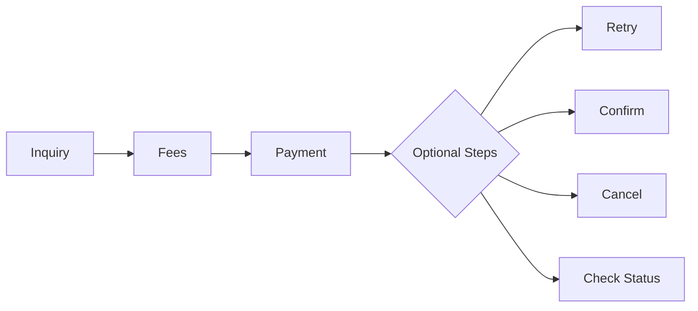

# 💰 Inquiry → Fees → Payment Flow

This flow is used for most transactional services in our ecosystem. It enables clients to:

- Retrieve billing data
- Calculate exact fees
- Execute and finalize the payment

---

## 🔁 Flow Diagram
